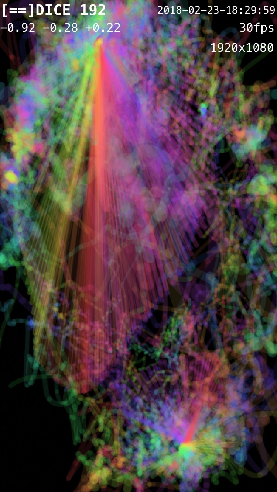

# DICE-AGE
Dice thru the ages.

- Archive of John Henry Thompson's interactive art source code.

Copyright (c) 1987-present John Henry Thompson

Where shall we be in years to come?

My latest project, [2017 DICE](http://www.johnhenrythompson.com/3-dice)  was inspired by life work.

Check it out.

# Inventions

[2000's DICE powerpoint ](aa/2000's%20-%20DICE/-DICE%20Work-1/Presentation1.ppt)

